# Species Quick Reference

The garden's plant palette — a reference list, generated from
[`data/species.csv`](data/species.csv). The sortable, filterable version is the
[live species table](https://dev-grimnir.github.io/meadow-public/table.html), and the
one-page habitat & compliance summary is the
[habitat record](https://dev-grimnir.github.io/meadow-public/habitat.html). Planting
**status, timing, sourcing, and field notes** live in [`plantingplan.md`](plantingplan.md).

## Legend

- **Native:** Native to the northeast US (No = non-native)
- **Root:** Root system — fibrous / taproot / rhizomatous / tuberous / shrub
- **Bloom:** Flowering months (flower color)
- **Height:** Mature height range
- **Light:** Full sun (6+ hrs), part sun (3–6 hrs), shade (<3 hrs)
- **Soil:** Tolerance / preference
- **Spread:** Horizontal spread or clump diameter at maturity
- **Juglone:** Black-walnut allelopathy tolerance
- **Wildlife:** Pollinator/wildlife value (High / Med / Low)
- **Sow rate:** Fall direct-sow seeding rate (seeds/ft²), the middle of the self-thinning plateau — dense enough to saturate under losses, not so dense it crowds. Low-germination species (milkweeds, butterfly weed, blazing star) are set higher on purpose. — = established by transplant or nursery stock, not sown by area.
- **Host:** Caterpillar host role, where applicable
- **Safety / ID:** Identification or handling cautions

---

### Blazing Star (*Liatris* sp.)

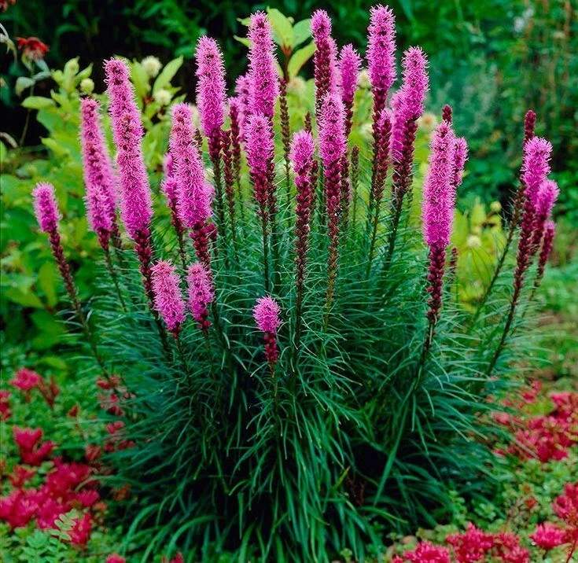

- **Native:** Yes
- **Root:** Taproot
- **Bloom:** Jun–Aug (pink-purple)
- **Height:** 1–3 ft
- **Light:** Full sun
- **Soil:** Well-drained; drought-tolerant
- **Spread:** 12–18 in
- **Juglone:** Tolerant
- **Wildlife:** High
- **Sow rate:** 8–10/ft² (erratic germ over 2 years — sow high)

### Black-Eyed Susan (*Rudbeckia hirta* or *R. fulgida*)

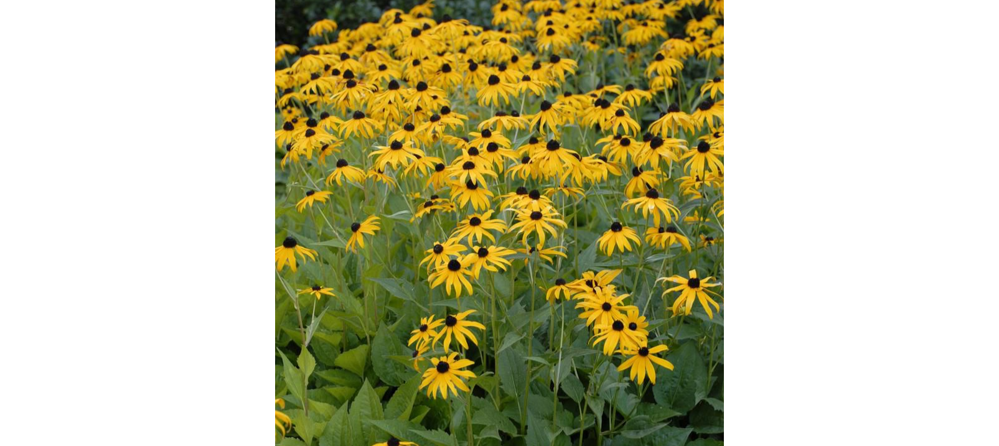

- **Native:** Yes
- **Root:** Fibrous
- **Bloom:** Jul–Oct (yellow)
- **Height:** 2–3 ft
- **Light:** Full sun–part sun
- **Soil:** Well-drained; dry-tolerant; poor OK
- **Spread:** 12–18 in; self-seeds
- **Juglone:** Tolerant
- **Wildlife:** High (Silvery Checkerspot host; goldfinch seed heads)
- **Sow rate:** 10–15/ft² (small seed; press in, don't bury)
- **Note:** Added 2026-07-23 for the mid-high south bed in place of purple bee balm.
  Species (*hirta* vs. *fulgida*) chosen at seed order.

### Butterfly Weed (*Asclepias tuberosa*)

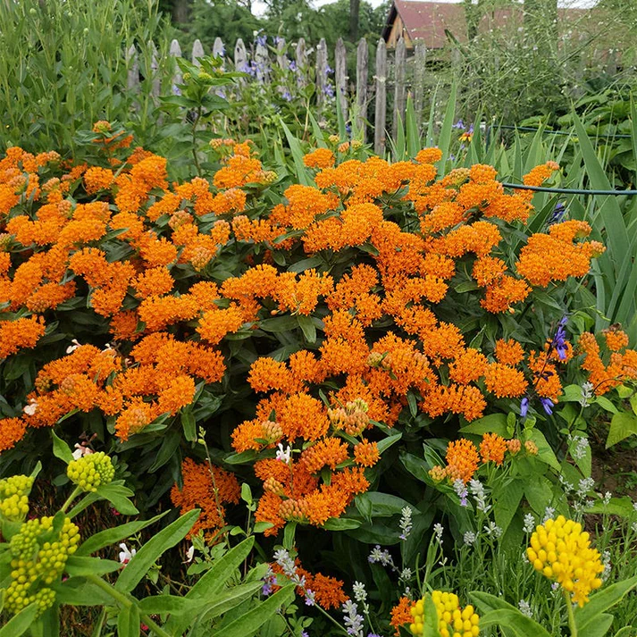

- **Native:** Yes
- **Root:** Taproot
- **Bloom:** May–Jul (orange)
- **Height:** 1.5–2.5 ft
- **Light:** Full sun
- **Soil:** Sandy-loam, very well-drained; avoids wet
- **Spread:** 12–18 in
- **Juglone:** Poor
- **Wildlife:** High
- **Sow rate:** 6–8/ft² (poor germ observed; clumper, won't fill by spread)
- **Host:** Monarch

### Common Milkweed (*Asclepias syriaca*)

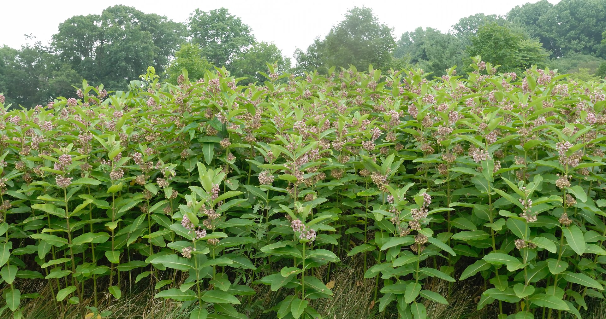

- **Native:** Yes
- **Root:** Taproot
- **Bloom:** Jun–Jul (pink)
- **Height:** 3–5 ft
- **Light:** Full sun
- **Soil:** Clay-loam, moist; tolerates wet
- **Spread:** Rhizomatous (aggressive)
- **Juglone:** Marginal
- **Wildlife:** High
- **Sow rate:** 4–6/ft² (poor germ observed; spreads once established)
- **Host:** Monarch

### Day Lily (*Hemerocallis fulva*, likely)

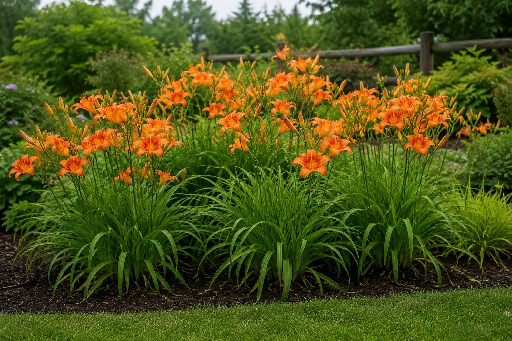

- **Native:** No
- **Root:** Tuberous
- **Bloom:** Jun–Jul (orange)
- **Height:** 2–3 ft
- **Light:** Full sun–part shade
- **Soil:** Tolerates poor soil; adaptable
- **Spread:** 24–36 in
- **Juglone:** Tolerant
- **Wildlife:** Low
- **Sow rate:** — (transplant / division, not sown)

### Golden Alexanders (*Zizia aurea*)

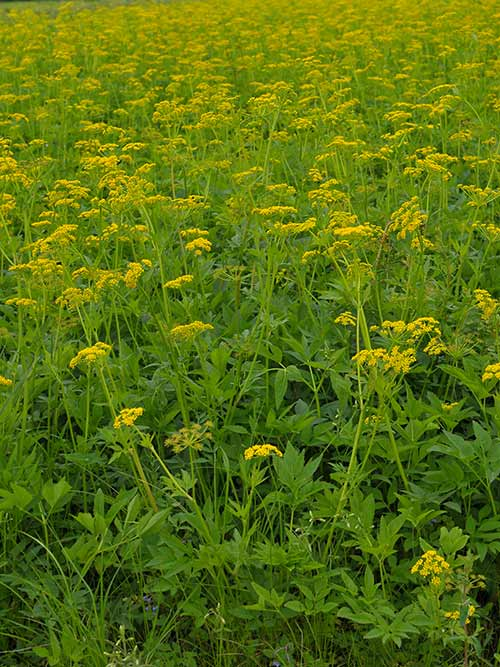

- **Native:** Yes
- **Root:** Fibrous
- **Bloom:** May–Jun (yellow)
- **Height:** 1.5–2.5 ft
- **Light:** Full sun–part shade
- **Soil:** Moist, well-drained; clay-tolerant
- **Spread:** 12–18 in
- **Juglone:** Tolerant
- **Wildlife:** High
- **Sow rate:** 5–8/ft² (medium seed, 12–18" clump)
- **Host:** Black swallowtail
- **⚠ Safety / ID:** BUY SEED ONLY — Apiaceae look-alikes (wild parsnip, poison/water hemlock, giant hogweed); never wild-collect

### Ironweed (*Vernonia noveboracensis*)

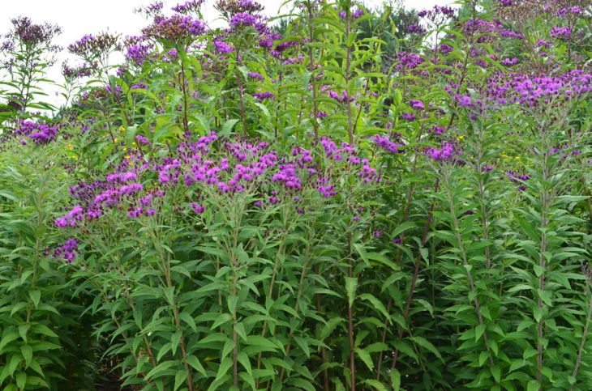

- **Native:** Yes
- **Root:** Taproot
- **Bloom:** Aug–Oct (purple)
- **Height:** 3–6 ft
- **Light:** Full sun–part sun
- **Soil:** Moist; clay-tolerant
- **Spread:** 24–36 in
- **Juglone:** Tolerant
- **Wildlife:** Med
- **Sow rate:** 5–6/ft² (tall, wide clump — fewer needed)

### Mountain Laurel (*Kalmia latifolia*)

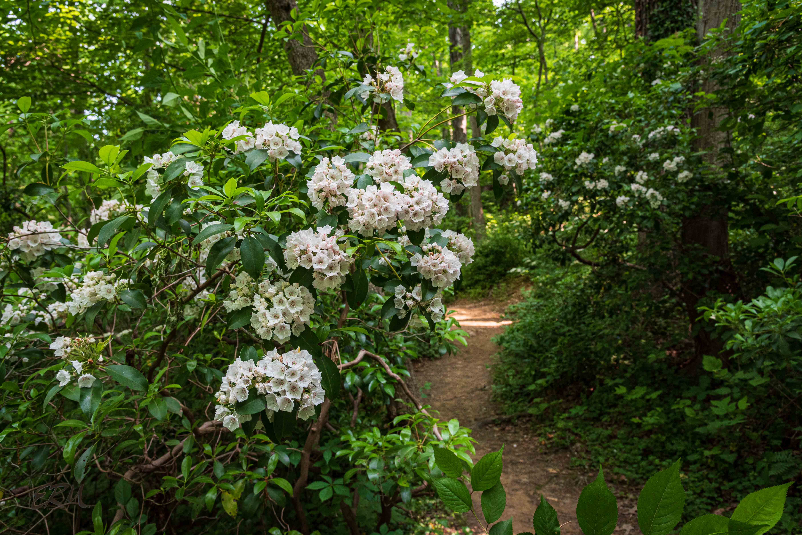

- **Native:** Yes
- **Root:** Shrub
- **Bloom:** May (white-pink)
- **Height:** 4–8 ft (shrub)
- **Light:** Part shade
- **Soil:** Acidic, well-drained; ericaceous
- **Juglone:** Tolerant
- **Wildlife:** Med
- **Sow rate:** — (potted from seed; not sown by area)
- **Safety / ID:** Needs ericoid mycorrhizal inoculation

### Mountain Mint (*Pycnanthemum virginianum*)

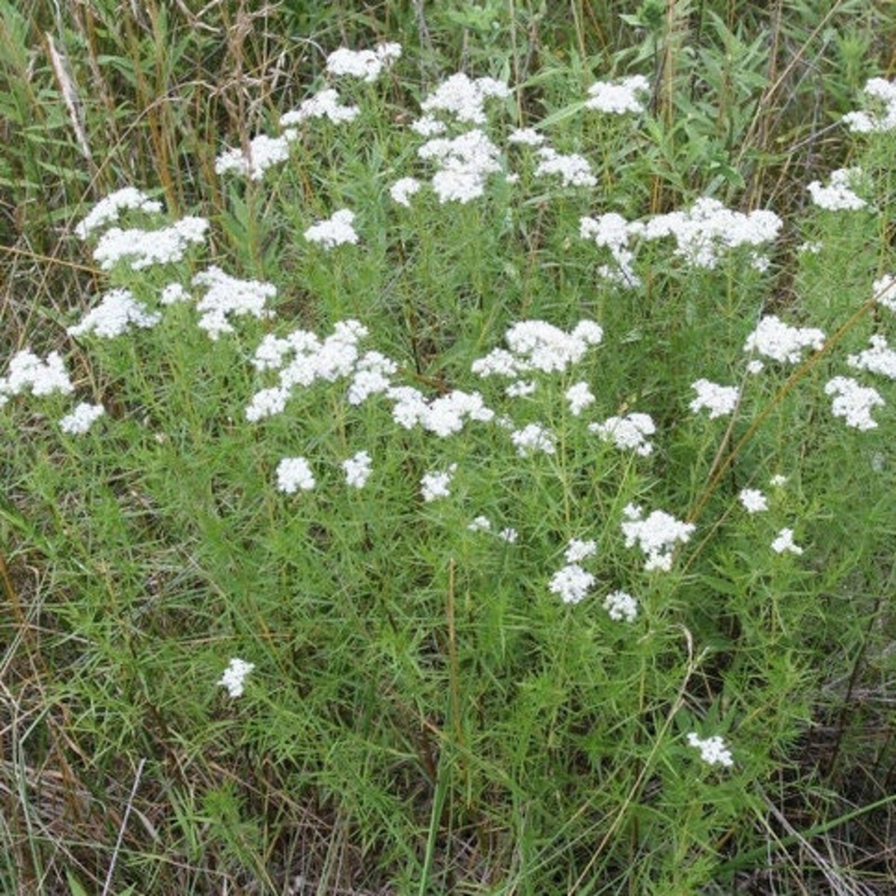

- **Native:** Yes
- **Root:** Rhizomatous
- **Bloom:** Jun–Sep (white/pink)
- **Height:** 2–3 ft
- **Light:** Full sun–part shade
- **Soil:** Well-drained; drought-tolerant
- **Spread:** Rhizomatous; 24–36 in
- **Juglone:** Tolerant
- **Wildlife:** High
- **Sow rate:** 10–12/ft² (rhizome spreader — modest rate saturates)

### New England Aster (*Symphyotrichum novae-angliae*)

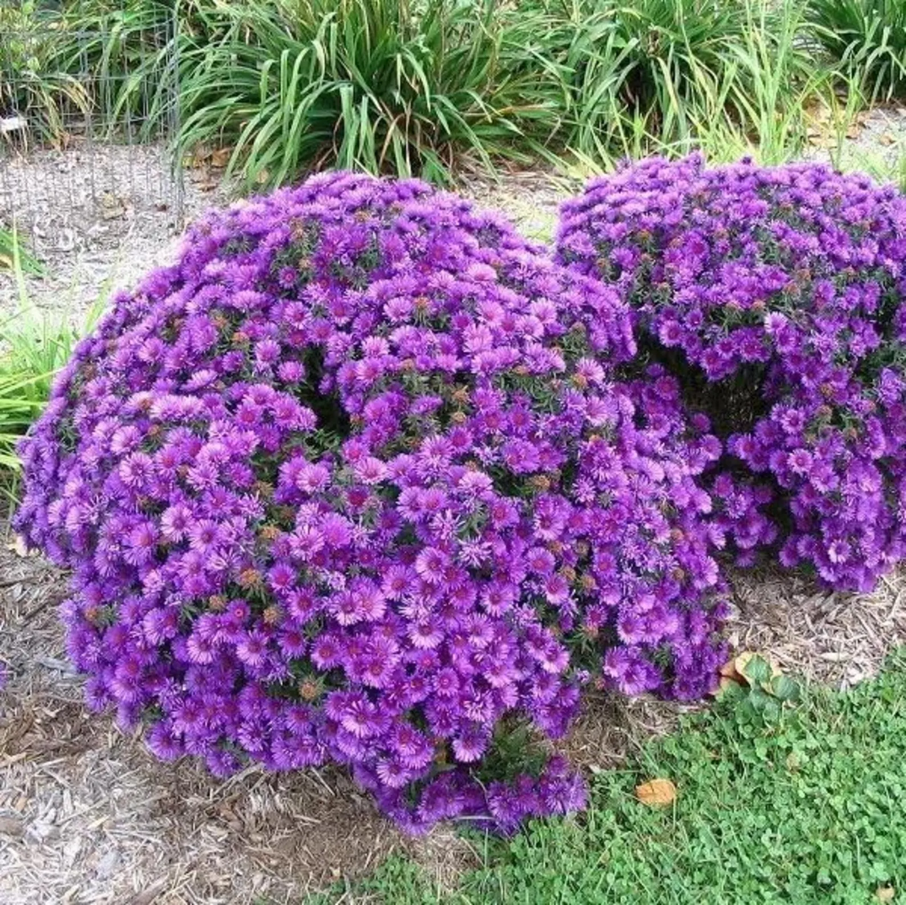

- **Native:** Yes
- **Root:** Fibrous
- **Bloom:** Aug–Oct (purple)
- **Height:** 3–6 ft
- **Light:** Full sun–part sun
- **Soil:** Moist to wet; clay-tolerant
- **Spread:** 18–36 in
- **Juglone:** Tolerant
- **Wildlife:** High
- **Sow rate:** 8–10/ft² (biggest plant — fewest per ft²)

### Purple Bee Balm (*Monarda fistulosa*)

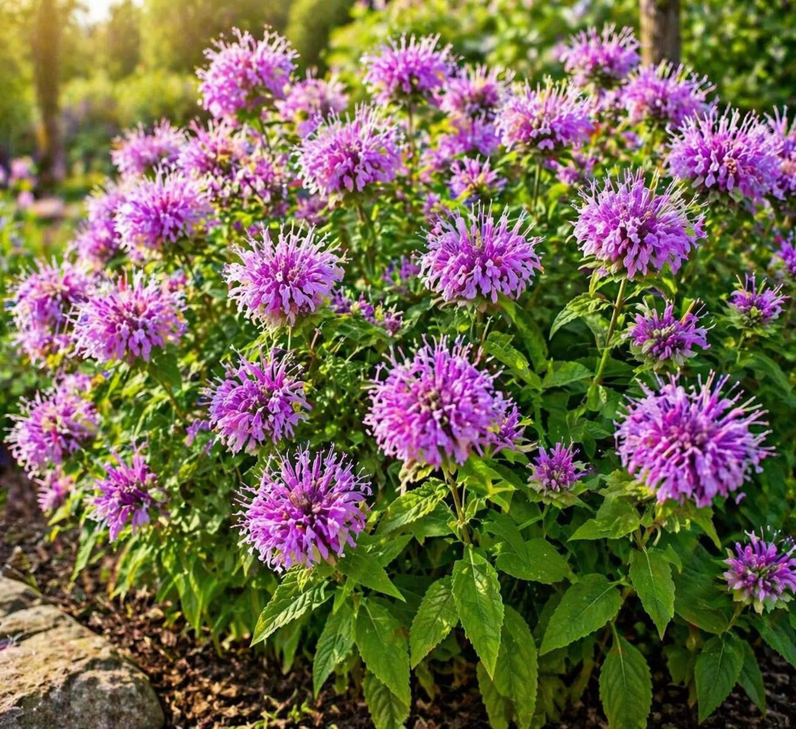

- **Status note:** Retired from the sown plan 2026-07-23 (same genus as scarlet bee balm —
  they hybridize and blur). Kept only as the spared established clumps; not re-sown.
- **Native:** Yes
- **Root:** Fibrous
- **Bloom:** Jul–Aug (lavender)
- **Height:** 2–4 ft
- **Light:** Full sun–part shade
- **Soil:** Dry to moist; tolerates poor soil
- **Spread:** 18–30 in
- **Juglone:** Tolerant
- **Wildlife:** High
- **Sow rate:** 12–15/ft² (clump, good germ)

### Purple Coneflower (*Echinacea purpurea*)

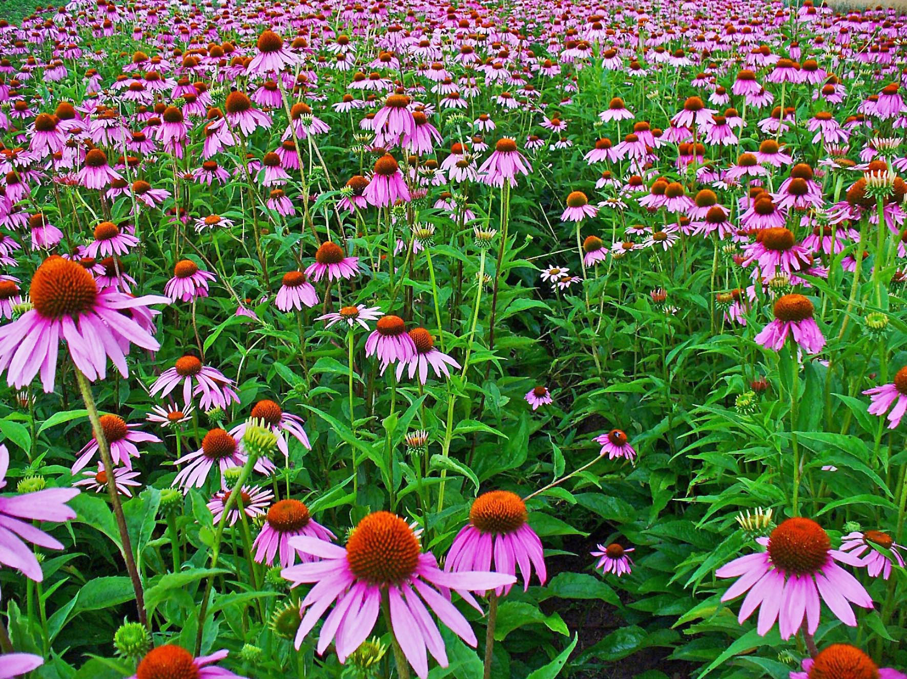

- **Native:** Yes
- **Root:** Taproot
- **Bloom:** Jun–Sep (pink-purple)
- **Height:** 2–4 ft
- **Light:** Full sun
- **Soil:** Well-drained; tolerates poor/sandy soil
- **Spread:** 12–24 in
- **Juglone:** Tolerant
- **Wildlife:** High
- **Sow rate:** 6–8/ft² (taproot, 12–24" clump)

### Scarlet Bee Balm (*Monarda didyma*)

- **Native:** Yes
- **Root:** Fibrous
- **Bloom:** Jul–Sep (red)
- **Height:** 2–3 ft
- **Light:** Full sun–part shade
- **Soil:** Moist, well-drained; tolerates clay
- **Spread:** 18–24 in
- **Juglone:** Tolerant
- **Wildlife:** High
- **Sow rate:** 12–15/ft² (clump, good germ)

### Smooth Blue Aster (*Symphyotrichum laeve*)

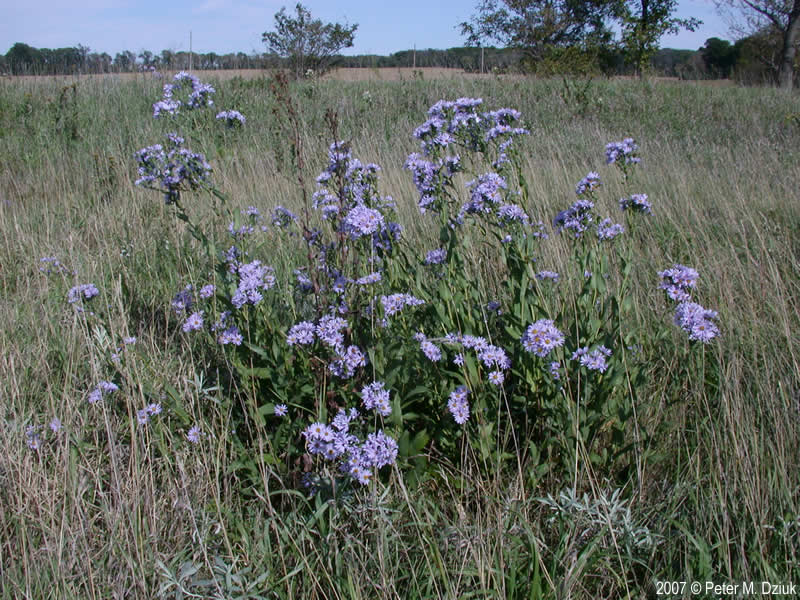

- **Native:** Yes
- **Root:** Fibrous
- **Bloom:** Aug–Oct (blue)
- **Height:** 2–3 ft
- **Light:** Full sun–part sun
- **Soil:** Dry to moist; well-drained
- **Spread:** 18–24 in
- **Juglone:** Tolerant
- **Wildlife:** High
- **Sow rate:** 10–12/ft² (18–24" clump)

### Spicebush (*Lindera benzoin*)

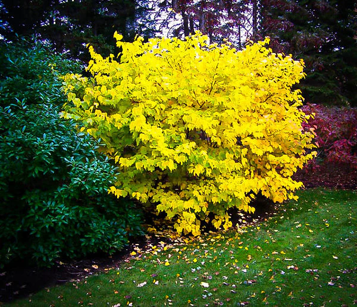

- **Native:** Yes
- **Root:** Shrub
- **Bloom:** Apr (yellow)
- **Height:** 6–10 ft (shrub)
- **Light:** Part shade–shade
- **Soil:** Moist, well-drained
- **Juglone:** Tolerant
- **Wildlife:** High
- **Sow rate:** — (nursery stock; not sown by area)
- **Host:** Spicebush swallowtail

### White Yarrow (*Achillea millefolium* ssp. *millefolium*)

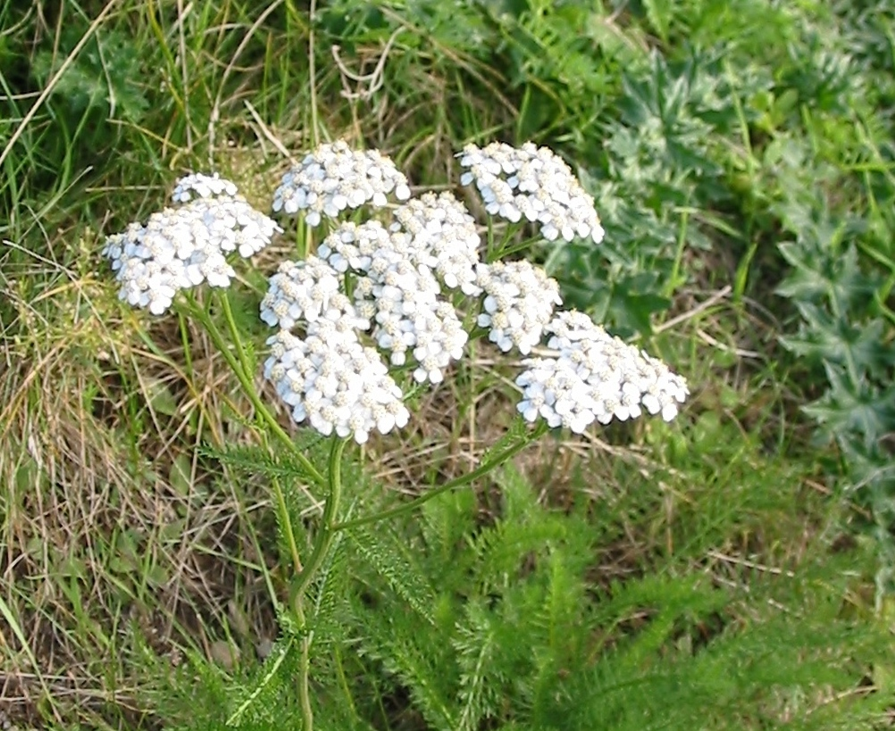

- **Native:** Yes
- **Root:** Rhizomatous
- **Bloom:** Jun–Aug (white)
- **Height:** 1–2 ft
- **Light:** Full sun
- **Soil:** Well-drained; drought-tolerant; poor OK
- **Spread:** 18–24 in
- **Juglone:** Tolerant
- **Wildlife:** Med
- **Sow rate:** 12–15/ft² (mat-former, tiny seed, fills)
- **Safety / ID:** White wild form only — avoid pink/yellow cultivars

### Wild Columbine (*Aquilegia canadensis*)

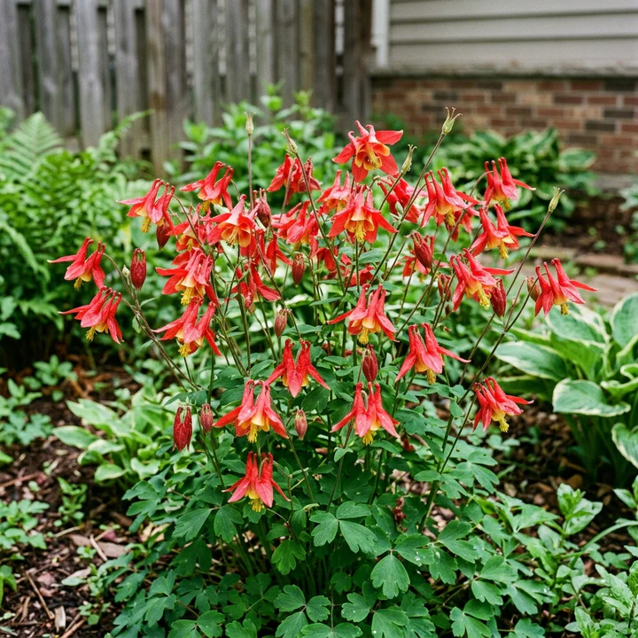

- **Native:** Yes
- **Root:** Fibrous
- **Bloom:** Apr–May (red-yellow)
- **Height:** 1–2 ft
- **Light:** Part shade–full sun
- **Soil:** Well-drained; rocky/sandy
- **Spread:** 12–18 in
- **Juglone:** Tolerant
- **Wildlife:** High
- **Sow rate:** 6–8/ft² (medium seed, self-seeds in)
